# My dehumidifier becomes an IoT device

### Introduction

I've had this TROTEC TTK70 device for many years. It helps me keep my basement dry in the summer.
You can, of course, turn the dehumidifier on every day and let it run for a few hours.
My problem is that I want to use the power from the PV system for this. However, since I leave the house at 6:30 a.m., it doesn't generate enough electricity, depending on the time of year.
At first, I considered using a timer. But this device only beeps once and then stops working when the power comes back on.

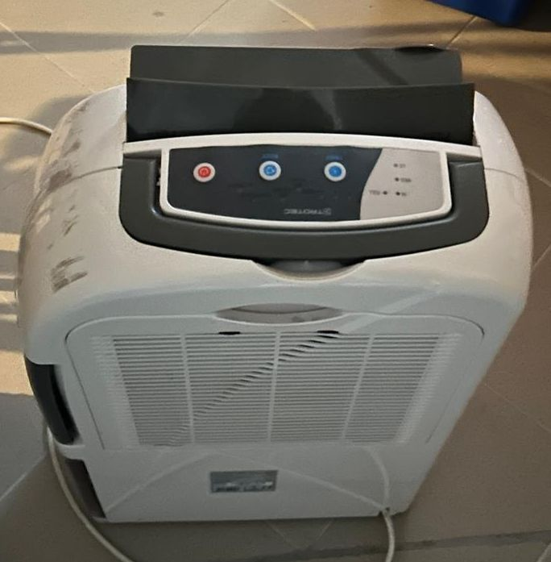

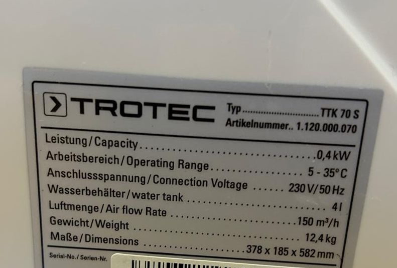

## Implementation

Since the circuit diagram attached to the side was also not informative

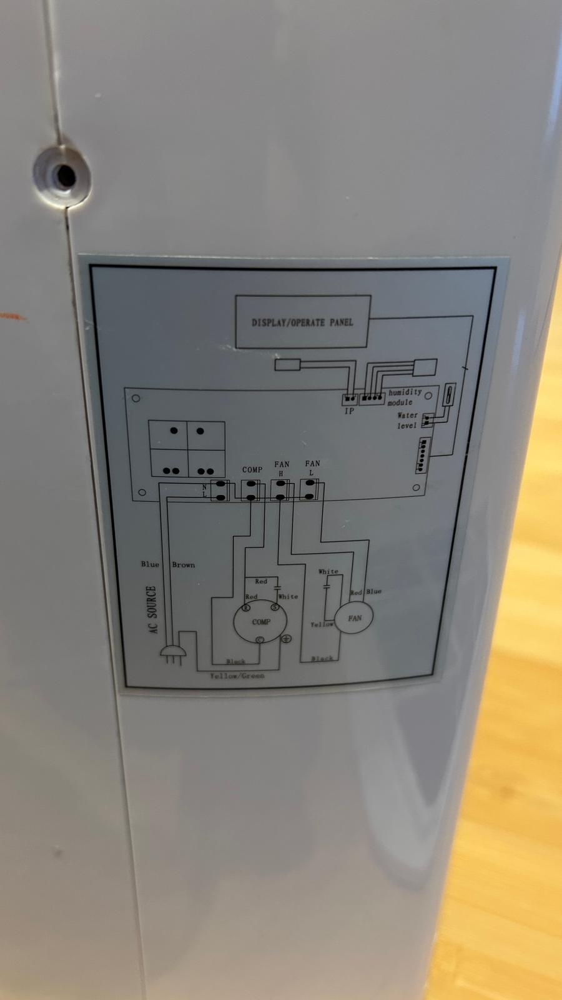

I took a look at the device from the inside and noticed that there was a control panel. I drew its circuit diagram and considered how it might work.

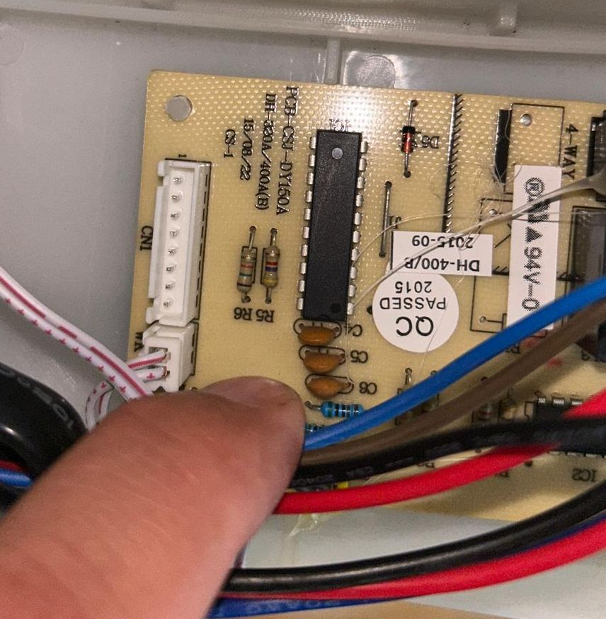

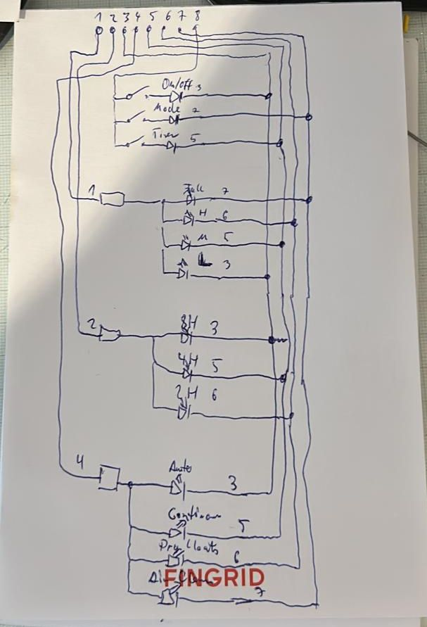

The connector has 8 contacts. You can see from the diodes that 1, 2, and 4 are positive, and 3, 5, 6, and 7 are negative.

Since not all LEDs light up at the same time, there must be a control system behind them. I figured that the microcontroller in the device connects lines 3, 5, 6, and 7 to negative one after the other and turns on lines 1, 2, and 4 at the right moment to turn on the LED. We'll refer to lines 3, 5, 6, and 7 as rotating lines.

That leaves the three buttons and line 8. The diodes are there to prevent the wrong LEDs from lighting up when two buttons are pressed at once. And the function is also somewhat instructive. If you pull line eight high with a pull-up resistor, it goes low when the connected rotating line goes negative and the button is pressed.

The only remaining issue is the power supply. However, since the dehumidifier has a transformer built in that always supplies 12V AC when plugged in, that was quickly resolved. Just connect two wires to the output of the rectifier circuit; that's it.

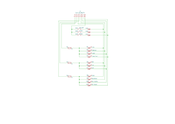

So I gathered a few parts from my stash and started experimenting on the bash board.

I quickly decided to try it with ESPHome and an ESP32-S3 mini that was lying on my desk.

The main problem with the dehumidifier is a microcontroller connected to an LS7805. The ESP32 only requires 3.3V on the GPIOs. If I connect the ESP32 to the same ground via the voltage converter and place the data lines on 3.3V pull-up resistors like the manufacturer did with the buttons, it should work. I didn't even need to solder the pull-ups. They're already built into the ESP32. While lengthening the pins, I noticed that I have two ESP32s that are identical in size but not identical. I have an ESP32-S3 mini and an ESP32-S3 tiny. It's important to note that GPIO 3 is in a different location on both. Since there are boot issues with this GPIO, you shouldn't use GPIO 3. Furthermore, the ESP32-S3 tiny must be installed upside down. Since an ESP32 connected to a 3.3V supply died in another project, I'm now only using 5V voltage converters. However, it seems to be recommended that the ESP generate the 3.3V itself.

Simple transistors should be sufficient for the buttons. Since I don't know the breakdown voltages, I preferred to use diodes there.

Oh, the diodes don't really matter, just like the transistors. I had a large pile of them in stock here. But any other NPN transistor or any other diode will work.

I didn't feel like drawing the ESP, and I couldn't find a finished one. So I just used two connectors.

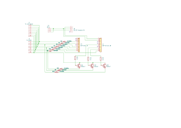

A friend was kind enough to mill a circuit board for me on his CNC milling machine. It looks a bit better than a perforated board.

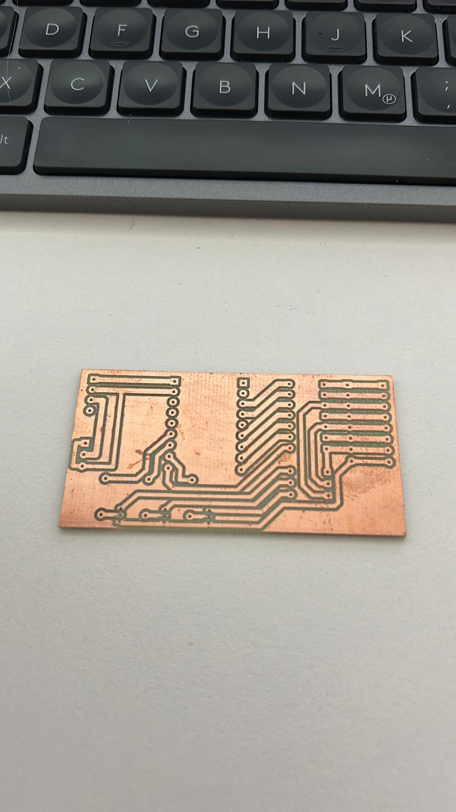

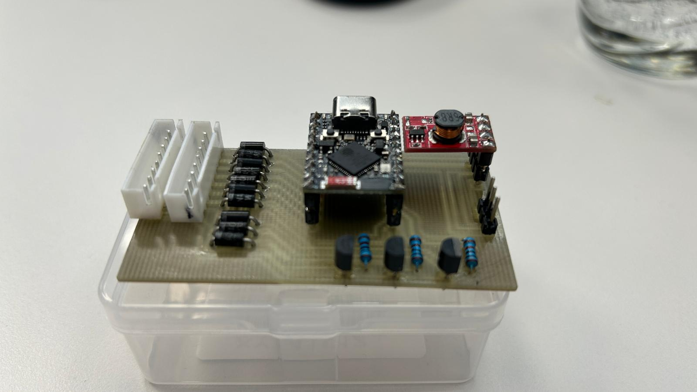

After inserting the board into the device, the ESP32 rebooted every time I turned the device on and off. This wasn't good. I then used the other controller from Waveshare. This one also requires a clean head and has a different GPIO order. It works with this one. I also added the capacitor to the board because I was trying to use it to prevent the mini ESP32 from booting. But it seems to be the proximity to the relays and not the supply voltage. The capacitor is 2200uF and is connected to the 5V line to the controller.

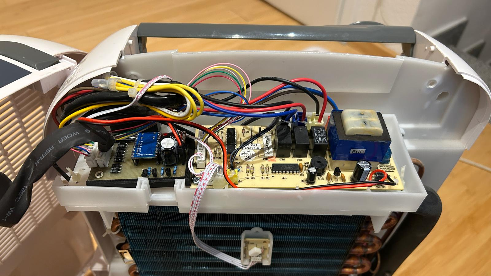

And then the YAML for ESP Home, and here it is in Home Assistant. You can select one of the four modes and OFF using the top two selections. The bottom one allows you to select the integrated timers 2H, 4H, 8H, and OFF. After the controller has selected the setting, it resets – which means nothing is selected there. The states are displayed below as text sensors. There are also two binary sensors for on and water tank full.

When you select a mode, the ESP first checks whether the device is on or off and presses the power button if necessary. The ESP32 then presses the mode button repeatedly until the correct mode is selected.

For the timer, it presses the timer button repeatedly until the selection is made.

Press a button? Not really, it controls the transistors, but to the microcontroller in the dehumidifier, it looks like a button press...

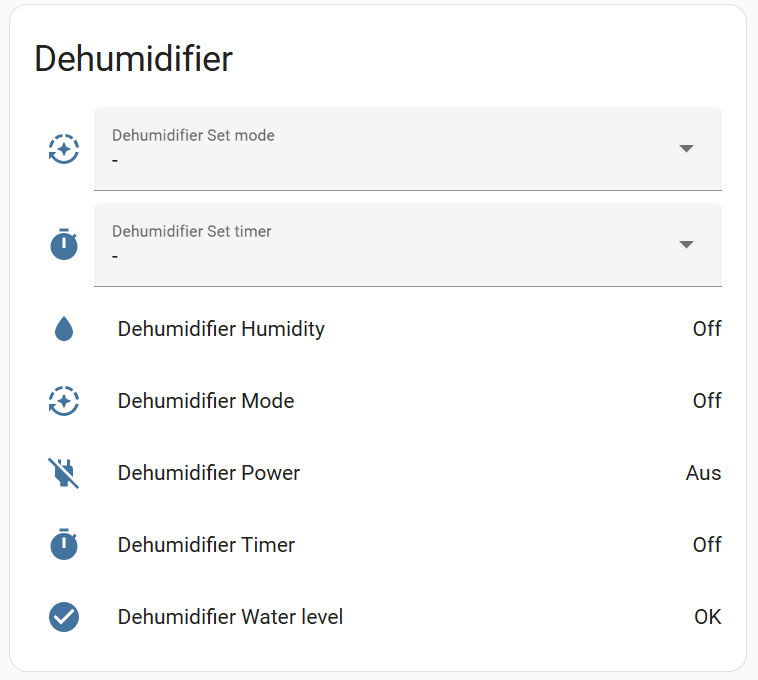

Do you have such great projects? Write me...

